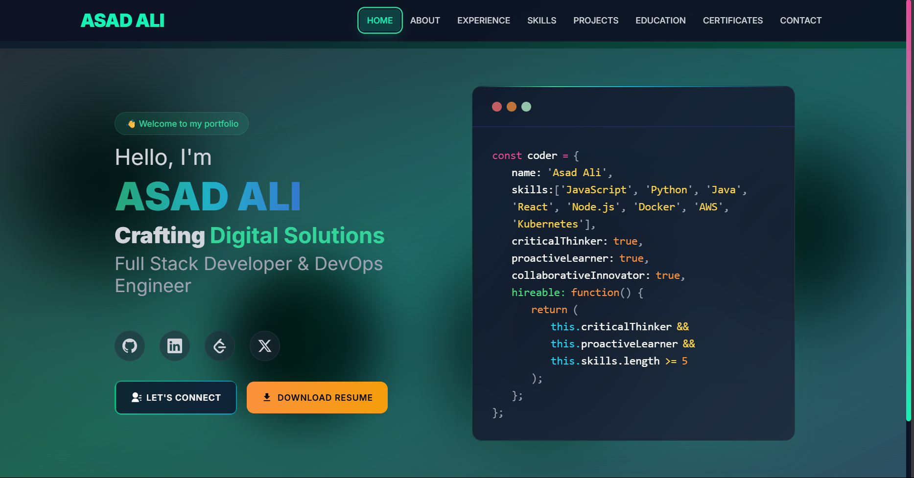

 # Asad Ali - Developer Portfolio

 This is my personal portfolio website built with **Next.js 15**, showcasing my projects, certifications, education, skills, and experiences. It highlights my journey as a developer and serves as a central place for my professional work.

 ---

 ## 🚀 Technologies Used
 - Next.js 15
 - React 19
 - Tailwind CSS
 - Framer Motion
 - React Icons
 - Shadcn/UI

 ## 📁 Features
 - Home, About, Skills, Projects, Education, Certificates, and Contact sections
 - Certification and Education Timeline
 - Responsive design (Mobile and Desktop friendly)
 - Smooth page transitions and animations
 - Fixed Navbar and Footer with scrollable content
 - Code-split and lazy-loaded sections for performance
 - Clean, modern UI with custom SVG and Lottie assets

 ---

 ## 🆕 Recent Updates
 - Improved mobile performance and fixed white box/lag issues
 - Refactored Projects section for better scrolling and UX
 - Fixed Navbar (always visible) and Footer (fixed at bottom)
 - Cleaned up unused/commented code and removed deprecated files
 - Security and dependency updates
 - Enhanced smooth transitions and loading states

 ---

 ## 📸 Screenshot

 

 ---

 ## Getting Started

 1. Clone the repo
 2. Install dependencies with `npm install`
 3. Run the development server with `npm run dev`

 ---

 Feel free to reach out via the Contact section!

