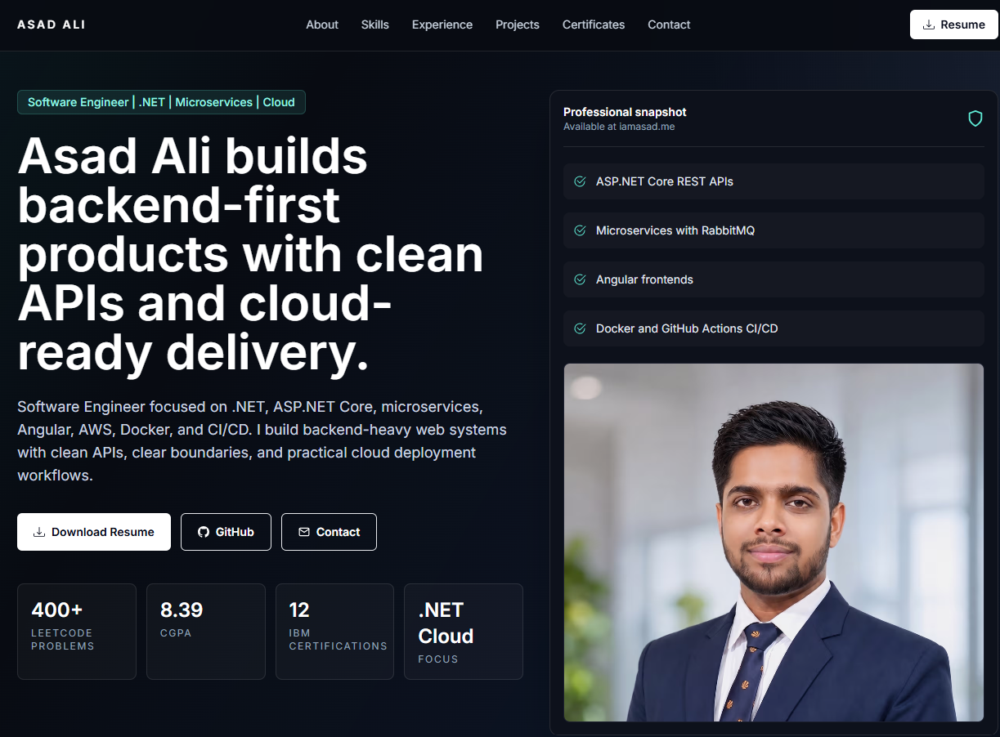

# Asad Ali - Developer Portfolio

This is my personal portfolio website built with **Next.js 15** and React 19. It presents my current profile, featured project work, certificates, skills, and contact details in a polished single-page layout.

 ---

## 🚀 Technologies Used
- Next.js 15
- React 19
- Tailwind CSS
- Framer Motion
- React Icons
- Sass

## 📁 Features
- Responsive hero section with resume, social links, and profile card
- Featured project section with ZyntraPay and supporting project cards
- Certificate section with direct Google Drive links
- Skills, experience, education, and contact sections
- Dark theme with smooth transitions and loading states
- Optimized asset handling with local `public/image` files
- Blog page for Dev.to articles

 ---

## 🆕 Recent Updates
- Updated all resume buttons to use the new Google Drive link
- Added certificate Drive links for the portfolio certificate cards
- Refreshed the hero section layout and theme colors
- Fixed broken image paths by pointing to the actual `public/image` assets
- Removed unused legacy components and data files
- Updated loading, navbar, and scroll-to-top styling to match the current theme

 ---

## 📸 Screenshot

 ---

## Getting Started

1. Clone the repo
2. Install dependencies with `npm install`
3. Run the development server with `npm run dev`

## Build Status

The current version builds successfully with `npm run build`.

 ---

Feel free to reach out via the Contact section.

